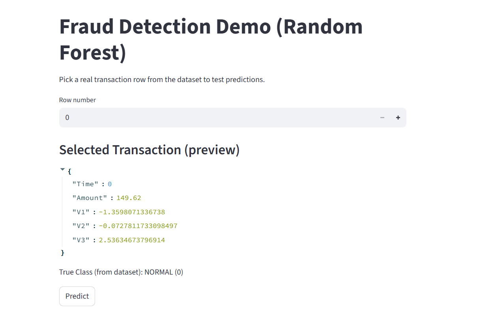
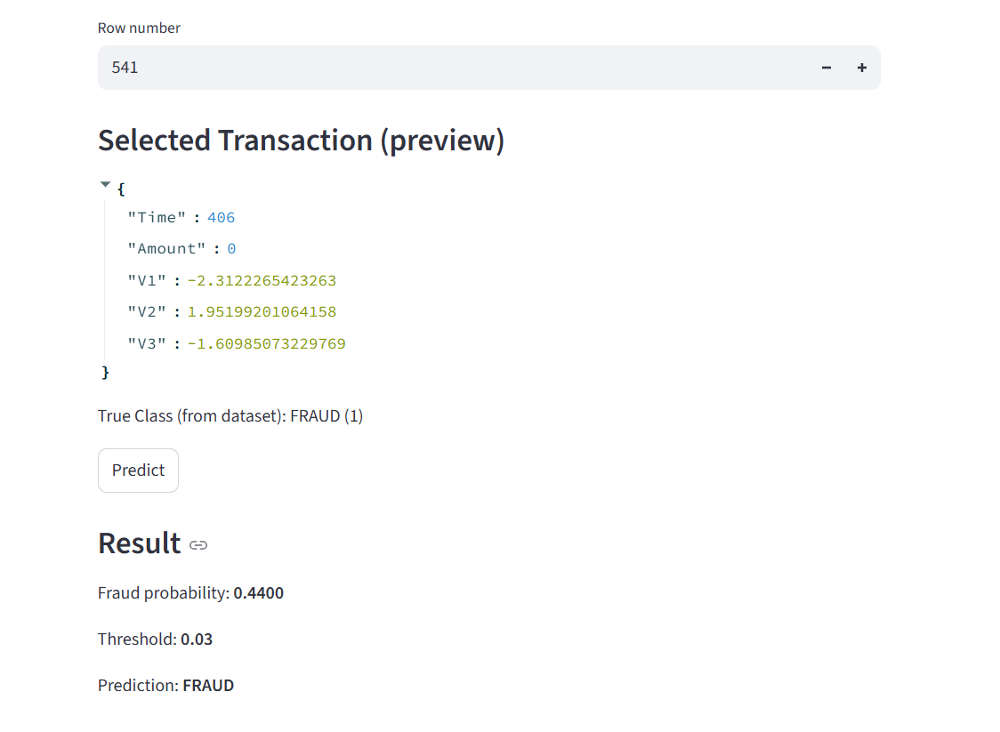
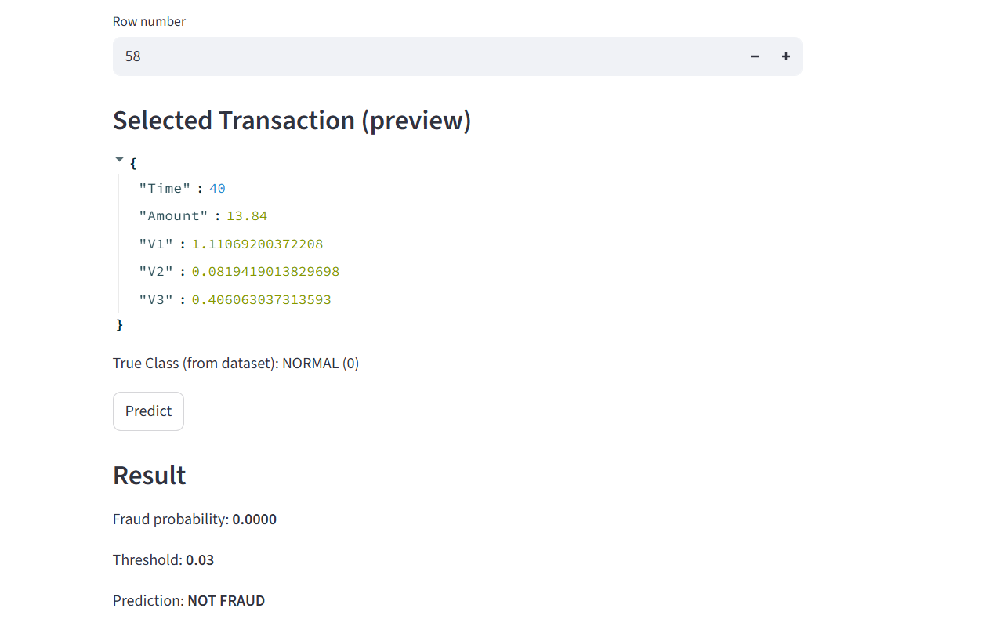

# Fraud Detection System (Credit Card Transactions)

A machine learning project to detect the fraudulent credit card transactions using imbalanced learning evaluation (PR-AUC) and cost-sensitive thresholding.  
Includes a Streamlit demo app for interactive predictions.

## What this project includes
- Data exploration (EDA) and imbalanced classification
- Model comparison using **Precision–Recall AUC (PR-AUC)**
- Best model selected: **Random Forest**
- **Cost-based threshold optimization** (business-driven decision rule)
- Streamlit app demo for predictions

## Dataset
- Dataset: Credit Card Fraud Detection (`creditcard.csv`)
- Rows: 284,807 transactions
- Fraud cases: 492 (highly imbalanced)
- Features: `Time`, `Amount`, and PCA-transformed variables `V1`–`V28`
- Target: `Class` (0 = Normal, 1 = Fraud)

## Why accuracy is not enough
Fraud data is extremely imbalanced (~0.17% fraud).  
A model can achieve >99% accuracy by predicting **everything as normal**, while missing fraud completely.

So this project evaluates models using:
- Precision, Recall, F1-score
- **Precision–Recall AUC (PR-AUC)** (main metric)

## Model comparison (PR-AUC)
| Model | PR-AUC |
|------|--------:|
| Logistic Regression | 0.7639 |
| Random Forest (balanced) | **0.8591** |
| XGBoost | 0.8565 |

**Selected model:** Random Forest (highest PR-AUC).

## Cost-sensitive threshold optimization
Instead of using the default threshold (0.5), the decision threshold was optimized using business costs:

- Cost of missing fraud (FN): **$500**
- Cost of false alarm (FP): **$5**

Best threshold found: **0.03**  
Result at best threshold:
- False Positives (FP): 123
- False Negatives (FN): 10
- Total cost = `500*FN + 5*FP = 5615`

## How to run

### 1) Create environment (conda)
```bash
conda create -n fraud_ml python=3.10
conda activate fraud_ml
pip install -r requirements.txt

python -m streamlit run app/streamlit_app.py
```

## Demo screenshot



### Fraud Transaction



### Not Fraud Transaction



